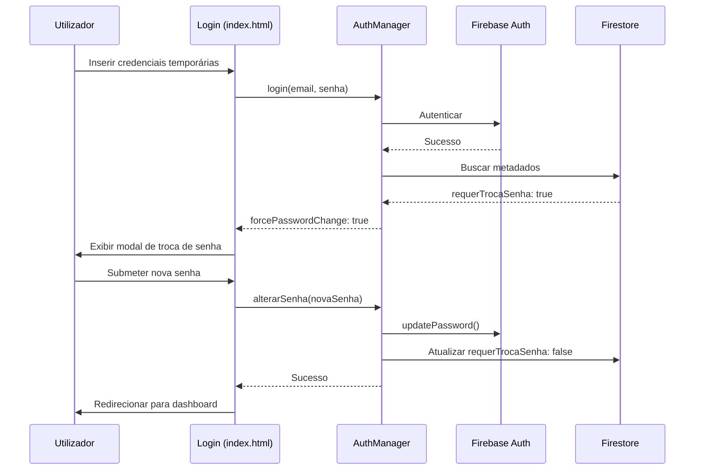

# Funcionalidade de Troca de Senha Obrigatória - SGQ-SECURITY

## 📋 Visão Geral

Esta implementação adiciona um **gatekeeper de segurança** que força os utilizadores a alterarem suas senhas temporárias no primeiro acesso, em conformidade com os requisitos do **Sistema Axioma v5.1.0** e o **Protocolo SGQ-SECURITY**.

## 🔒 Características de Segurança

### 1. Flag `requerTrocaSenha`
- Todos os novos utilizadores criados via `setup-users-cdl.js` recebem automaticamente `requerTrocaSenha: true`
- Esta flag é armazenada no documento do utilizador no Firestore
- A flag é removida apenas após a alteração bem-sucedida da senha

### 2. Validação no Login
- O método `login()` em `auth.js` verifica a flag `requerTrocaSenha`
- Se `true`, retorna `forcePasswordChange: true` ao invés de redirecionar para o dashboard
- O utilizador é mantido autenticado mas não pode acessar o sistema até alterar a senha

### 3. Interface de Troca de Senha
- Modal responsivo no `index.html` com validação robusta
- Requisitos de senha enforçados:
  - Mínimo de 8 caracteres
  - Pelo menos uma letra maiúscula
  - Pelo menos uma letra minúscula
  - Pelo menos um número
  - Pelo menos um caractere especial (@, #, $, etc.)

### 4. Método `alterarSenha()`
- Atualiza a senha no Firebase Authentication
- Remove a flag `requerTrocaSenha` do Firestore
- Registra logs de auditoria SGQ-SECURITY

## 📝 Fluxo de Operação



## 🚀 Como Utilizar

### Para Administradores

1. **Criar novos utilizadores:**
   ```bash
   npm run setup:users
   ```
   - Todos os utilizadores serão criados com a senha temporária: `Cdl@Manaus2026`
   - A flag `requerTrocaSenha: true` será definida automaticamente

2. **Informar aos utilizadores:**
   - Comunique as credenciais temporárias de forma segura
   - Informe que será solicitada a troca de senha no primeiro acesso

3. **Validar a implementação:**
   ```bash
   npm run verify:security
   ```
   - Verifica se todas as 36 verificações SGQ-SECURITY passam

### Para Utilizadores Finais

1. **Primeiro acesso:**
   - Acesse o sistema com email e senha temporária
   - Um modal de troca de senha será exibido automaticamente
   
2. **Definir nova senha:**
   - Insira uma nova senha que atenda aos requisitos
   - Confirme a nova senha
   - Submeta o formulário

3. **Acesso subsequente:**
   - Utilize a nova senha definida
   - O sistema não solicitará troca de senha novamente

## 🔐 Requisitos de Senha

A nova senha deve conter:
- ✅ Mínimo de 8 caracteres
- ✅ Pelo menos uma letra maiúscula (A-Z)
- ✅ Pelo menos uma letra minúscula (a-z)
- ✅ Pelo menos um número (0-9)
- ✅ Pelo menos um caractere especial (@, #, $, %, etc.)

**Exemplos de senhas válidas:**
- `Cdl@Seguro123`
- `Axioma#2026!`
- `Manaus$Forte99`

## 📊 Logs de Auditoria

Todos os eventos são registrados com o prefixo `[SGQ-SECURITY]`:

### Login com troca pendente:
```
[SGQ-SECURITY] Troca de senha obrigatória pendente | UID: abc123
```

### Troca de senha bem-sucedida:
```
[SGQ-SECURITY] ✅ Senha alterada com sucesso | UID: abc123
[SGQ-SECURITY] Timestamp: 2026-01-05T18:00:00.000Z
```

### Erro na troca de senha:
```
[SGQ-SECURITY] ❌ Erro ao alterar senha: [mensagem do erro]
[SGQ-SECURITY] Timestamp: 2026-01-05T18:00:00.000Z
```

## 🛠️ Arquivos Modificados

1. **setup-users-cdl.js**
   - Adiciona `requerTrocaSenha: true` aos novos utilizadores

2. **assets/js/auth.js**
   - Import `updatePassword` do Firebase Auth
   - Verifica flag `requerTrocaSenha` no método `login()`
   - Novo método `alterarSenha()` para gestão de senha

3. **index.html**
   - Modal de troca de senha com validação
   - Handler para resposta `forcePasswordChange`
   - Validação de requisitos de senha no frontend

4. **verify-sgq-security.js**
   - Adiciona seção 4: "Funcionalidade de Troca de Senha"
   - 11 novas verificações automáticas

## ✅ Validação da Implementação

Execute o script de verificação:

```bash
node verify-sgq-security.js
```

**Resultado esperado:**
```
✓ PROTOCOLO SGQ-SECURITY IMPLEMENTADO COM SUCESSO!
Verificações Passadas: 36/36 (100%)
```

## 📚 Conformidade

Esta implementação está em conformidade com:
- ✅ Sistema Axioma v5.1.0
- ✅ Protocolo SGQ-SECURITY
- ✅ Arquitetura Zero Trust
- ✅ NIST Password Guidelines
- ✅ OWASP Authentication Best Practices

## 🔄 Próximos Passos Recomendados

1. **Rotação de Senhas:** Implementar política de expiração de senha (90 dias)
2. **MFA:** Adicionar autenticação multifator via Firebase
3. **Password History:** Prevenir reutilização das últimas 5 senhas
4. **Account Lockout:** Bloquear conta após 5 tentativas falhadas
5. **Password Strength Meter:** Indicador visual da força da senha

## 📞 Suporte

Para questões ou problemas relacionados a esta funcionalidade, consulte:
- [SECURITY_ENHANCEMENTS_SGQ.md](./SECURITY_ENHANCEMENTS_SGQ.md)
- [SECURITY_REMEDIATION_GUIDE.md](./SECURITY_REMEDIATION_GUIDE.md)
- [AUTHENTICATION_GUIDE.md](./AUTHENTICATION_GUIDE.md)

---

**Versão:** 1.0.0  
**Data:** 2026-01-05  
**Protocolo:** SGQ-SECURITY v5.1.0
