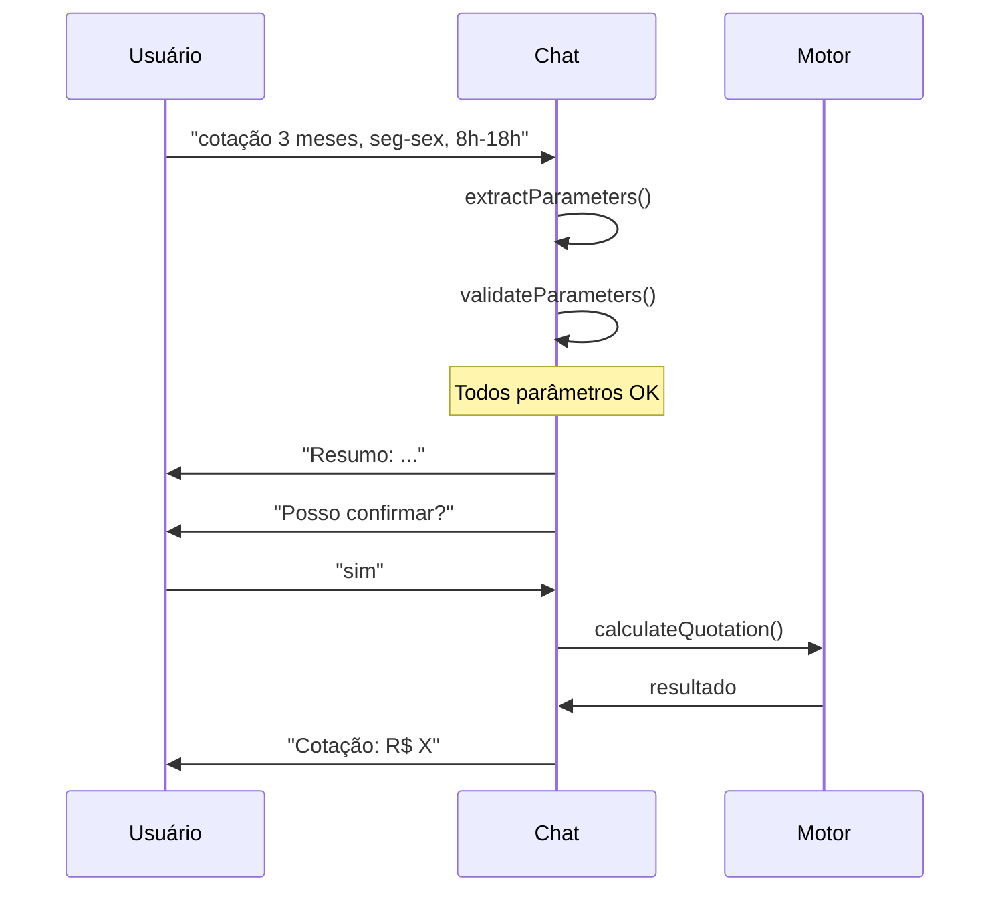
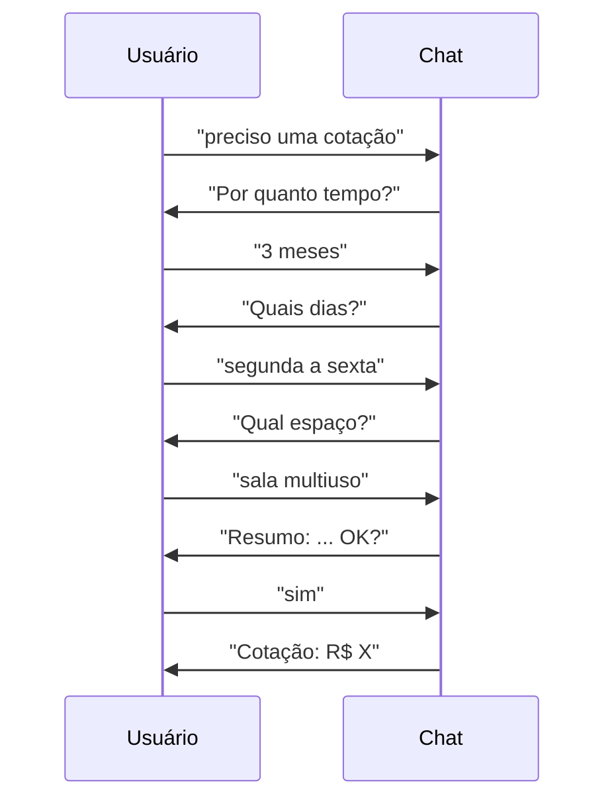
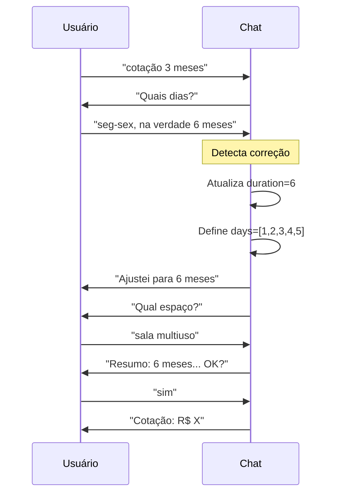
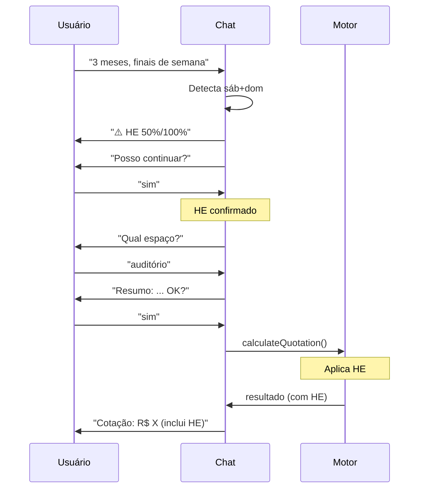

# 🔄 Fluxos Conversacionais - Chat IA de Cotação

## 📋 Índice

1. [Visão Geral](#visão-geral)
2. [Estados da Conversa](#estados-da-conversa)
3. [Fluxos Principais](#fluxos-principais)
4. [Tratamento de Exceções](#tratamento-de-exceções)
5. [Transições de Estado](#transições-de-estado)

---

## 🎯 Visão Geral

Este documento descreve todos os fluxos conversacionais do Chat IA, incluindo estados, transições e tratamento de casos especiais.

---

## 🔄 Estados da Conversa

### Diagrama de Estados

```
┌─────────────┐
│   INITIAL   │ ◄─────┐
│             │       │
│ Aguardando  │       │ reset/nova cotação
│ início      │       │
└──────┬──────┘       │
       │              │
       │ comando      │
       ▼              │
┌─────────────┐       │
│  GATHERING  │       │
│             │       │
│ Coletando   │       │
│ parâmetros  │       │
└──────┬──────┘       │
       │              │
       │ todos coletados
       ▼              │
┌─────────────┐       │
│  REFINING   │       │
│             │       │
│ Refinando e │       │
│ confirmando │       │
└──────┬──────┘       │
       │              │
       │ confirmado   │
       ▼              │
┌─────────────┐       │
│ CONFIRMING  │       │
│             │       │
│ Aguardando  │       │
│ confirmação │       │
│ final       │       │
└──────┬──────┘       │
       │              │
       │ sim          │
       ▼              │
┌─────────────┐       │
│  COMPLETED  │───────┘
│             │
│ Cotação     │
│ gerada      │
└─────────────┘
```

### Descrição dos Estados

#### 1. INITIAL
- **Descrição:** Estado inicial, aguardando comando do usuário
- **Ações disponíveis:** Saudação, ajuda, iniciar cotação
- **Próximo estado:** GATHERING (ao iniciar cotação)

#### 2. GATHERING
- **Descrição:** Coletando parâmetros obrigatórios
- **Parâmetros necessários:**
  - Duração (meses ou dias)
  - Dias da semana
  - Espaço
  - Horários (opcional, usa padrão)
  - Funcionários (opcional)
- **Próximo estado:** REFINING (quando todos coletados)

#### 3. REFINING
- **Descrição:** Mostrando resumo e permitindo ajustes
- **Ações disponíveis:** Confirmar, ajustar parâmetros
- **Próximo estado:** CONFIRMING (após ajustes)

#### 4. CONFIRMING
- **Descrição:** Aguardando confirmação explícita do usuário
- **Ações disponíveis:** Confirmar (sim), cancelar, ajustar
- **Próximo estado:** COMPLETED (após confirmação)

#### 5. COMPLETED
- **Descrição:** Cotação gerada e exibida
- **Ações disponíveis:** Aplicar, nova cotação, exportar
- **Próximo estado:** INITIAL (nova cotação)

---

## 🎯 Fluxos Principais

### Fluxo 1: Cotação Completa de Uma Vez



**Código:**
```javascript
// Estado: INITIAL → GATHERING
this.currentContext.stage = 'gathering';
const params = this.extractParameters(input);

// Validação
const validation = this.validateParameters(params);
if (validation.isValid) {
    // GATHERING → REFINING
    this.currentContext.stage = 'refining';
    return this.showPartialSummaryAndAskConfirmation();
}
```

### Fluxo 2: Cotação com Coleta Incremental



**Código:**
```javascript
// Estado: INITIAL → GATHERING
this.currentContext.stage = 'gathering';

// Primeira entrada
const params1 = this.extractParameters("3 meses");
const validation1 = this.validateParameters(params1);
// validation1.missing = ['dias da semana', 'espaço']

// Segunda entrada
const params2 = this.extractParameters("segunda a sexta");
this.currentContext.params.days = params2.days;
const validation2 = this.validateParameters(this.currentContext.params);
// validation2.missing = ['espaço']

// Terceira entrada
const params3 = this.extractParameters("sala multiuso");
this.currentContext.params.space = params3.space;
const validation3 = this.validateParameters(this.currentContext.params);
// validation3.isValid = true

// GATHERING → REFINING
this.currentContext.stage = 'refining';
```

### Fluxo 3: Cotação com Correções



**Código:**
```javascript
// Detectar correção
const input = "seg-sex, na verdade 6 meses";
const newParams = this.extractParameters(input);

// Mesclar com contexto atual
this.currentContext.params = {
    ...this.currentContext.params,
    ...newParams
};

// Log da alteração
this.logInferredParameter("Alterado duração", newParams.duration);
```

### Fluxo 4: Cotação com Horas Extras



**Código:**
```javascript
// Verificar necessidade de HE
if (this.needsHEConfirmation(params)) {
    this.currentContext.waitingHEConfirmation = true;
    this.currentContext.pendingParams = params;
    return this.requestHEConfirmation(params);
}

// Ao confirmar
if (this.currentContext.waitingHEConfirmation && this.isConfirmation(input)) {
    this.currentContext.heConfirmed = true;
    this.currentContext.waitingHEConfirmation = false;
    // Continuar fluxo
}
```

---

## 🚨 Tratamento de Exceções

### Exceção 1: Entrada Ambígua

```
👤 Usuário: "preciso de 3"

🤖 Bot: "Entendi que precisa de uma cotação! 
        Você quer dizer 3 meses? 📅"

👤 Usuário: "sim"

🤖 Bot: "Perfeito! 3 meses então."
```

**Estratégia:**
- Fazer suposição educada
- Solicitar confirmação
- Oferecer alternativas

### Exceção 2: Informação Incompleta

```
👤 Usuário: "seg sex"

🤖 Bot: "Entendi: Segunda a Sexta, certo? 👍"

👤 Usuário: "sim"

🤖 Bot: "Ótimo! E qual horário?"
```

**Estratégia:**
- Interpretar da melhor forma
- Confirmar interpretação
- Solicitar complemento

### Exceção 3: Comando Não Reconhecido

```
👤 Usuário: "xyzabc"

🤖 Bot: "😅 Ops! Não entendi direito. 
        
        Você pode:
        • Criar uma cotação (ex: 'cotação 3 meses')
        • Ver espaços disponíveis
        • Pedir ajuda
        
        O que prefere?"
```

**Estratégia:**
- Ser humilde e amigável
- Oferecer opções claras
- Guiar o usuário

### Exceção 4: Interrupção de Fluxo

```
👤 Usuário: "cotação 3 meses"

🤖 Bot: "Ótimo! Quais dias?"

👤 Usuário: "tchau"

🤖 Bot: "Até logo! 👋
        
        Sua cotação parcial foi salva.
        Quando voltar, posso continuar de onde paramos! 😊"
```

**Estratégia:**
- Reconhecer despedida
- Salvar contexto
- Oferecer retomada

### Exceção 5: Dados Inválidos

```
👤 Usuário: "cotação para -5 meses"

🤖 Bot: "Hmm, duração negativa não é possível! 😅
        
        Quantos meses você realmente precisa?"
```

**Estratégia:**
- Identificar problema
- Explicar brevemente
- Solicitar correção

---

## 🔀 Transições de Estado

### Matriz de Transições

| Estado Atual | Evento | Próximo Estado | Condição |
|--------------|--------|----------------|----------|
| INITIAL | Comando cotação | GATHERING | - |
| INITIAL | Saudação | INITIAL | - |
| INITIAL | Ajuda | INITIAL | - |
| GATHERING | Todos parâmetros | REFINING | validation.isValid |
| GATHERING | Faltam parâmetros | GATHERING | !validation.isValid |
| REFINING | Confirmação | CONFIRMING | - |
| REFINING | Ajuste | GATHERING | - |
| CONFIRMING | "sim" | COMPLETED | Sem HE pendente |
| CONFIRMING | "sim" | CONFIRMING | Com HE pendente |
| CONFIRMING | Ajuste | GATHERING | - |
| COMPLETED | Nova cotação | INITIAL | - |
| COMPLETED | Aplicar | COMPLETED | - |
| * | "tchau" | INITIAL | - |

### Código de Transições

```javascript
/**
 * Gerencia transições de estado
 */
handleStateTransition(currentState, event, context) {
    switch(currentState) {
        case 'initial':
            if (this.isQuotationRequest(event)) {
                this.currentContext.stage = 'gathering';
            }
            break;
        
        case 'gathering':
            const validation = this.validateParameters(context.params);
            if (validation.isValid) {
                this.currentContext.stage = 'refining';
            }
            break;
        
        case 'refining':
            if (this.isConfirmation(event)) {
                this.currentContext.stage = 'confirming';
                this.currentContext.waitingForFinalConfirmation = true;
            }
            break;
        
        case 'confirming':
            if (this.isConfirmation(event)) {
                if (this.needsHEConfirmation(context.params)) {
                    // Permanecer em confirming até HE ser confirmado
                    this.currentContext.waitingHEConfirmation = true;
                } else {
                    this.currentContext.stage = 'completed';
                }
            }
            break;
        
        case 'completed':
            if (this.isNewQuotationRequest(event)) {
                this.currentContext.stage = 'initial';
                this.resetContext();
            }
            break;
    }
}
```

---

## 🎭 Cenários Especiais

### Cenário 1: Retomada de Conversa

```javascript
// Ao reabrir chat
if (chatAI.currentContext.stage !== 'initial' && 
    chatAI.currentContext.lastQuotation) {
    chatAI.addMessage(
        '👋 Bem-vindo de volta!\n\n' +
        'Você tem uma cotação salva. Quer:\n' +
        '• "Continuar" de onde parou\n' +
        '• "Nova cotação" para começar do zero',
        'bot'
    );
}
```

### Cenário 2: Múltiplas Correções

```javascript
// Histórico de correções
this.currentContext.corrections = [];

// Ao corrigir
if (this.isCorrection(input)) {
    this.currentContext.corrections.push({
        field: 'duration',
        oldValue: 3,
        newValue: 6,
        timestamp: new Date()
    });
}

// Limite de correções antes de confirmar
if (this.currentContext.corrections.length >= 3) {
    return "Vejo que você está ajustando bastante! 😊\n\n" +
           "Vamos revisar juntos para garantir que está tudo certo?";
}
```

### Cenário 3: Abandono e Reengajamento

```javascript
// Detectar inatividade (30 segundos sem resposta)
this.inactivityTimer = setTimeout(() => {
    if (this.currentContext.stage === 'gathering' || 
        this.currentContext.stage === 'confirming') {
        this.addMessage(
            "Ainda está aí? 😊\n\n" +
            "Se precisar de ajuda, é só chamar!\n" +
            "Ou diga 'salvar' para eu guardar o progresso.",
            'bot'
        );
    }
}, 30000);
```

---

## 📊 Métricas de Fluxo

### KPIs por Estado

| Estado | Métrica | Alvo |
|--------|---------|------|
| GATHERING | Tempo médio | <60s |
| GATHERING | Taxa de coleta completa | >90% |
| REFINING | Ajustes por cotação | <2 |
| CONFIRMING | Taxa de confirmação | >95% |
| COMPLETED | Tempo total do fluxo | <180s |

### Pontos de Medição

```javascript
// Log de transição
this.logStateTransition = function(from, to) {
    this.conversationHistory.push({
        type: 'state_transition',
        from: from,
        to: to,
        timestamp: new Date(),
        duration: Date.now() - this.stateStartTime
    });
};

// Métricas
this.getFlowMetrics = function() {
    return {
        totalDuration: this.getTotalDuration(),
        statesVisited: this.getUniqueStates(),
        corrections: this.currentContext.corrections.length,
        completionRate: this.calculateCompletionRate()
    };
};
```

---

## 🔍 Debugging de Fluxos

### Visualização de Estado

```javascript
// Console helper
console.log('Estado atual:', {
    stage: this.currentContext.stage,
    params: this.currentContext.params,
    waiting: {
        finalConfirmation: this.currentContext.waitingForFinalConfirmation,
        heConfirmation: this.currentContext.waitingHEConfirmation
    },
    history: this.conversationHistory.length
});
```

### Trace de Conversação

```javascript
// Export trace para debug
exportConversationTrace() {
    return {
        states: this.conversationHistory
            .filter(h => h.type === 'state_transition')
            .map(t => `${t.from} → ${t.to} (${t.duration}ms)`),
        inferences: this.currentContext.inferredParams,
        confirmations: this.currentContext.userConfirmations
    };
}
```

---

**Última atualização:** Dezembro 2024
**Versão:** 1.0.0
